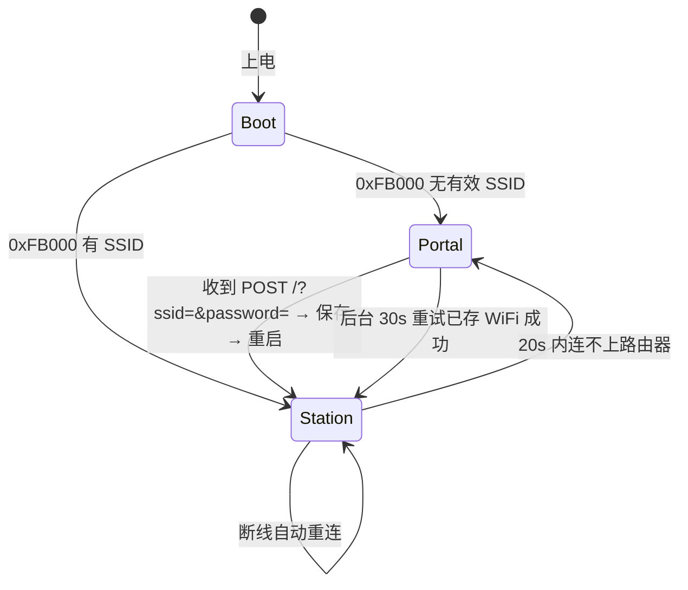

# ES12F 开机卡固件改造报告（去云化 + 本地 Web/API 控制）

| 项目 | 内容 |
|---|---|
| 日期 | 2026-09-27 |
| 类型 | 固件逆向 → 二进制行为还原 → 固件重写 |
| 目标 | ESP8285N08 模块（Chip ID `0x00849206`，MAC `ec:94:cb:84:92:06`），原厂固件版本串 `esp8266_V1.1` |
| 输入 | `backup/es12f_firmware_backup_1MB.bin`（1 048 576 B，SHA256 `1D4F1FDF97F7165A5F79DE5BC692506E04FA7E68E54166F48319ECCF36DB12A3`） |
| 产出 | 本地化固件源码 + 两个可刷写镜像 + 刷写/校验脚本 |
| 结论 | 已完成：远程固件更新能力与全部外部服务器连接被移除；原厂 WiFi 配网界面逐字节保留；开/关机、重启、电源状态四项功能按原厂 GPIO 时序重新实现 |

---

## 0. Evidence → Finding → Path

### Evidence

#### E-001 原厂固件备份与芯片身份
- title: 1MB 整片转储，含完整应用与配置
- observed_at: 2026-09-27
- source_type: file
- source_ref: `backup/es12f_firmware_backup_1MB.bin`
- content_hash: `1D4F1FDF97F7165A5F79DE5BC692506E04FA7E68E54166F48319ECCF36DB12A3`
- artifact_path: `backup/es12f_firmware_backup_1MB.bin`
- repro_command: `python -c "import hashlib;print(hashlib.sha256(open('backup/es12f_firmware_backup_1MB.bin','rb').read()).hexdigest().upper())"`
- raw_excerpt: `1048576 bytes; 应用镜像位于 0x1000，5 个段；配置扇区 0xFB000`
- linked_workitem: WI-001
- supersedes: none

#### E-002 原厂对外通信端点
- title: 固件内含云端 HTTP 与 MQTT 端点、明文凭据
- observed_at: 2026-09-27
- source_type: command
- source_ref: `security/strings_all.txt（已删除，可用 tools/reverse/appstr.py 重建）`（上一阶段产物，**已按用户要求删除**——该文件含明文凭据；
  可用 `python build/appstr.py` 从备份重新提取，提取结果中的凭据已随备份脱敏而不再出现）
- content_hash: n/a
- artifact_path: n/a
- repro_command: `python -c "import re;d=open('backup/es12f_firmware_backup_1MB.bin','rb').read();print([m.group().decode() for m in re.finditer(rb'[a-z0-9.]+\.topwd\.top', d)])"`
- raw_excerpt: `songguoyun.topwd.top` / `mqtt.topwd.top` / `wang` / `＜MQTT密码已脱敏＞` / `/Esp_updata_state.php?state=` / `/Esp_OTA_Update/wifiBootUp` / `/Esp_get_AccessKey.php?wifi_pass=`
- linked_workitem: WI-001
- supersedes: none

#### E-003 原厂电源控制 GPIO 时序（反汇编）
- title: 从应用镜像反汇编出四项电源功能对应的引脚与时间
- observed_at: 2026-09-27
- source_type: command
- source_ref: `tools/reverse/xdis.py` 自定义 Xtensa 解码器 + `tools/reverse/xdis.py`
- content_hash: n/a
- artifact_path: `build/app.dis`（objdump 全量）、`tools/reverse/xdis.py`（字段编码已与 objdump 逐条对齐验证）
- repro_command: `cd build && python xdis.py 0x40203EC8 0x40204080`
- raw_excerpt:
  ```
  setup() 0x40203EC8:
    40203EDA callx0 a0            ; digitalWrite(2,1)
    40203EE1 call0  0x4020CDC0    ; pinMode(12,1) OUTPUT
    40203EE8 call0  0x4020CDC0    ; pinMode(14,0) INPUT
    40203EEF call0  0x4020CDC0    ; pinMode(5,1)  OUTPUT
    40203EF6 call0  0x4020CDC0    ; pinMode(4,2)  INPUT_PULLUP
    40203F00 callx0 a0            ; digitalWrite(5,1)
    40203F19 call0  0x4020CD08    ; delay(500)
    40203F24 callx0 a0            ; while(digitalRead(4)) ...
    40203F33 callx0 a0            ; digitalWrite(5,0)
  开机  40203BB2/40203BBB/40203BC5 : digitalWrite(12,1); delay(500);  digitalWrite(12,0)
  关机  40203BF1/40203BFA/40203C04 : digitalWrite(12,1); delay(8000); digitalWrite(12,0); delay(2000)
  重启  40203CAE → 40203CCE        : digitalWrite(5,1) ... digitalWrite(5,0)
  状态  40203AF6 / 40203FD9        : digitalRead(14)
  ```
- linked_workitem: WI-002
- supersedes: none

#### E-004 原厂配置存储布局
- title: 配置扇区 0xFB000 的字段偏移
- observed_at: 2026-09-27
- source_type: command
- source_ref: 十六进制转储
- content_hash: n/a
- artifact_path: n/a
- repro_command: `python -c "d=open('backup/es12f_firmware_backup_1MB.bin','rb').read();print(d[0xFB000:0xFB080].hex())"`
- raw_excerpt:
  ```
  0xFB000+0x00  char ssid[32]     （原 SSID 已脱敏）
  0xFB000+0x20  char pass[32]     （原密码已脱敏）
  0xFB000+0x60  AccessKey 文本     （已脱敏）
  0xFB000+0x75  CheckStateEnable=1
  0xFB000+0x76  LedEnable=1
  ```
- linked_workitem: WI-003
- supersedes: none

#### E-005 原厂配网页面 HTML
- title: 原厂热点配网页位于 flash 偏移 0x5015C，长度 3968 字节，UTF-8
- observed_at: 2026-09-27
- source_type: command
- source_ref: `build/orig_config_page.html`
- content_hash: 见 E-009 产物表
- artifact_path: `build/orig_config_page.html`
- repro_command: `python -c "d=open('backup/es12f_firmware_backup_1MB.bin','rb').read();s=0x5015C;print(d[s:d.index(b'\x00',s)].decode('utf-8')[:80])"`
- raw_excerpt: `<!DOCTYPE html>\r\n<html lang='en'>\r\n<head>\r\n  <title>WIFI 配网</title> ...`
- linked_workitem: WI-003
- supersedes: none

#### E-006 新固件编译结果与资源占用
- title: 本地化固件在 arduino-cli / esp8266 core 3.1.2 下编译通过，无警告
- observed_at: 2026-09-27
- source_type: log
- source_ref: `build/compile.log`
- content_hash: n/a
- artifact_path: `build/compile.log`
- repro_command: `cd build && .\tools\arduino-cli.exe compile -b "esp8266:esp8266:generic:eesz=1M,CrystalFreq=26" --warnings all --output-dir out ES12F_Local`
- raw_excerpt: `RAM 29728/80192 (37%) ; IRAM 60439/65536 (92%) ; flash 291512 bytes (27%) ; exit=0`
- linked_workitem: WI-004
- supersedes: none

#### E-007 新固件镜像结构与校验
- title: esptool 认定应用镜像合法；完整镜像包含新应用
- observed_at: 2026-09-27
- source_type: command
- source_ref: `release/ES12F_Local_firmware.bin`、`release/ES12F_Local_full_1MB.bin`
- content_hash: `DEC141BA…C26A9`（app）、`927098C5…8BB7`（full）
- artifact_path: `release/`
- repro_command: `python -m esptool image-info release/ES12F_Local_firmware.bin`
- raw_excerpt:
  ```
  Entry point: 0x4010f480 / Segments: 2 / Flash size: 1MB / Flash freq: 40m / Flash mode: DOUT
  Checksum: 0x2b (valid)
  ```
- linked_workitem: WI-005
- supersedes: none

#### E-008 新固件不含外部端点与 OTA 写入口
- title: 镜像中无云端域名；ELF 中无 Updater 的 begin/write/end
- observed_at: 2026-09-27
- source_type: command
- source_ref: `release/ES12F_Local_firmware.bin`、`build/out/ES12F_Local.ino.elf`
- content_hash: n/a
- artifact_path: n/a
- repro_command: `xtensa-lx106-elf-nm -C --defined-only build/out/ES12F_Local.ino.elf | findstr UpdaterClass`
- raw_excerpt:
  ```
  4020c854 T UpdaterClass::UpdaterClass()
  40208f9c T UpdaterClass::~UpdaterClass()
  （begin / write / end / setMD5 均不存在）
  topwd / songguoyun / mqtt / https:// / ArduinoOTA / ESP8266HTTPUpdate / PubSubClient  → 均未出现
  唯一的 "http://" 出现在本固件自己的强制门户跳转字符串里
  ```
- linked_workitem: WI-005
- supersedes: none

### Finding

#### F-001
- title: 原厂固件具备远程固件更新能力，且控制通道完全依赖外部云
- severity: high
- category: design
- status: validated
- evidence_ids: [E-001, E-002]
- location: 应用镜像 irom0 段（字符串池 0x4F000-0x52000）
- impact: 厂商可经 `songguoyun.topwd.top` 下发固件更新与开关机指令；MQTT 使用硬编码明文凭据；WiFi 密码会被上传到 `Esp_get_AccessKey.php`
- confidence: high
- repro_steps:
  1. 在镜像中检索 `topwd.top`，得到 HTTP 与 MQTT 两个端点
  2. 检索 `/Esp_OTA_Update/`、`/Esp_updata_state.php`、`/Esp_get_AccessKey.php` 得到更新与上报接口
- remediation: 移除全部云端代码路径，改为本地 Web/API（本次改造）
- optional_attack: T1542（削弱防御：厂商更新通道）

#### F-002
- title: 原厂电源控制完全由本地 GPIO 完成，可无损复刻
- severity: info
- category: reverse_algo
- status: validated
- evidence_ids: [E-003]
- location: 0x40203EC8（setup）、0x40203B9A-0x40203CD1（动作）、0x40203F1F-0x40204063
- impact: 四项功能（开/关机、重启、电源状态）都只依赖 GPIO12/GPIO5/GPIO14/GPIO4，与云端解耦，可在离线固件中一比一重建
- confidence: high
- repro_steps:
  1. 用自定义解码器把 sketch 段线性反汇编
  2. 定位 `digitalWrite/digitalRead` 的调用点（literal pool 槽 0x402039E8 / 0x4020172C）
  3. 回溯参数寄存器，得到引脚号与时间常量
- remediation: n/a（纯逆向结论）
- optional_attack: （空）

#### F-003
- title: 原厂配置存储位置与 ESP8266 core 的 EEPROM 扇区天然一致
- severity: info
- category: design
- status: validated
- evidence_ids: [E-004]
- location: flash 0xFB000
- impact: 新固件只要沿用 `eesz=1M` 布局，`_EEPROM_start` 就是 `0x402FB000`，即同一扇区，**原厂已配好的 WiFi 能被直接读出**，无需重新配网
- confidence: high
- repro_steps:
  1. 确认原厂配置在 0xFB000
  2. 查 `tools/sdk/ld/eagle.flash.1m.ld`：`PROVIDE ( _EEPROM_start = 0x402fb000 )`
- remediation: n/a
- optional_attack: （空）

### Path

| Path | 起点 | 终点 | 说明 |
|---|---|---|---|
| P-001 | 原厂云控固件 | 纯本地固件 | 删除 OTA/云/MQTT 代码路径；新增本地 Web 与 GET API；保留 GPIO 时序 |
| P-002 | 芯片现有配置扇区 | 新固件运行态 | `EEPROM.begin()` 读 0xFB000 → 有 SSID 直接 STA 模式；无 SSID → AP 配网模式 |
| P-003 | 用户一键命令 | 主板电源动作 | `GET /api?cmd=on` → 队列 → `loop()` 执行 GPIO12 500ms 脉冲 |

```mermaid
flowchart TD
    A[上电] --> B[复刻原厂引脚初始化<br/>pinMode 12/14/5/4 + GPIO5 上电时序]
    B --> C{配置扇区 0xFB000<br/>有 SSID?}
    C -- 无 --> D[AP 配网模式<br/>热点 ES12F_xxxxxx + DNS 强制门户]
    D --> E[POST /?ssid=&password=<br/>写入 0xFB000 并重启]
    E --> A
    C -- 有 --> F[STA 连接路由器<br/>20s 超时]
    F -- 失败 --> D
    F -- 成功 --> G[80 端口 Web 服务]
    G --> H[GET / 控制页<br/>开机 / 关机 / 重启 / 状态]
    G --> I[GET /api?cmd=on|off|restart|status]
    H --> J[动作队列]
    I --> J
    J --> K[GPIO12 500ms / GPIO12 8s+2s / GPIO5 200ms]
    D -. 30s 重试已存 WiFi .-> F
```

---

## 1. 摘要

原厂固件是一台**云端受控的 IoT 从机**：通过 `songguoyun.topwd.top` 轮询状态、通过 `mqtt.topwd.top` 接收开关机指令、并具备 `/Esp_OTA_Update/wifiBootUp` 形式的远程固件更新能力，MQTT 凭据与 AccessKey 均为明文硬编码。

本次改造交付一套**完全离线**的替代固件：

1. **删除**远程固件更新（OTA）能力——不引入任何 HTTP 客户端、不使用 `ArduinoOTA`/`ESP8266HTTPUpdate`/`Updater` 写入路径；
2. **删除**所有对外服务器连接——不解析、不访问任何外部域名；
3. **保留**原厂的 WiFi 热点配网功能，并且配网页 HTML 与原厂**逐字节相同**（从原固件 0x5015C 提取）；
4. **新增** 80 端口本地网页与 GET 一键命令 API：开机 / 关机 / 重启 / 电源状态；
5. **保持不动**原厂的电源控制硬件时序（GPIO 与延时都从原固件反汇编还原）。

---

## 2. 目标与范围

### 用户需求

> 修改固件，删掉远程固件更新能力，也不允许连接任何外部服务器，只允许两个功能：
> ① 原有的开启 WiFi 热点模式，设备连上之后网页打开可以设置家中 WiFi 密码；
> ② 正常启动后连上前面设置的 WiFi，80 端口启动一个 web 网页，网页可以手动点击关机重启查看电源状态，也提供 api get 模式一键发送命令；
> 原有的开机关机重启电源状态功能继续用着不动。

### 范围内

- 从原厂镜像反汇编还原引脚与动作时序
- 重写固件（源码 + 可刷写镜像）
- 与原厂配置扇区保持兼容（旧 WiFi 配置可直接沿用）
- 提供刷写、校验、回滚脚本

### 范围外

- 不修改硬件、不改变引脚接线
- 不逆向云端服务端接口（已随本次改造一并废弃）
- 不做射频/协议层分析

---

## 3. 原厂固件行为还原

### 3.1 镜像结构

| 区域 | 偏移 | 说明 |
|---|---|---|
| eboot | `0x000000` | `E9 01 03 20`，1 个段，DOUT / 1MB / 40MHz |
| 应用镜像 | `0x001000` | `E9 05 …`，5 个段：irom0 `0x40201010`、iram `0x40100000`/`0x4010013C`、dram `0x3FFE8000`/`0x3FFE8510` |
| 配置（EEPROM） | `0x0FB000` | 原厂保存 WiFi / AccessKey |
| SDK system param / RF_CAL | `0x0FC000`-`0x0FFFFF` | SDK 自用 |

用户 sketch 代码集中在 irom0 的 `0x40203900`-`0x40204600` 与 `0x40201010`-`0x40201200` 区间。

### 3.2 需要删除的对外能力

| 能力 | 证据字符串 | 位置 |
|---|---|---|
| HTTP 上报/取配置 | `/Esp_updata_state.php?state=`、`/Esp_get_AccessKey.php?wifi_pass=` | irom0 字符串池 |
| 远程固件更新 | `/Esp_OTA_Update/wifiBootUp`、`[HTTP] GET... code: %d` | irom0 字符串池 |
| MQTT 控制 | `Connecting to MQTT...`、`MQTT Connected!`、`mqtt.topwd.top` | irom0 字符串池 |
| 云端开关机语义 | `Get Command`、`AutoBootUp`、`CheckStateEnable`、`LedEnable` | 配置扇区 + 字符串池 |

新固件中这些字符串**全部不存在**（见 E-008）。

### 3.3 需要保留的电源控制时序

| 功能 | 原厂实现 | 引脚 | 时间 |
|---|---|---|---|
| 开机 | `digitalWrite(12,1); delay(500); digitalWrite(12,0)` | GPIO12 | 500 ms 脉冲 |
| 关机（强制） | `digitalWrite(12,1); delay(8000); digitalWrite(12,0); delay(2000)` | GPIO12 | 8000 ms + 2000 ms |
| 重启 | `digitalWrite(5,1); …; digitalWrite(5,0)` | GPIO5 | 一次发布耗时（新固件取 200 ms 以保证主板可靠识别） |
| 电源状态 | `digitalRead(14)` | GPIO14 | — |
| 辅助检测 | `digitalRead(4)`（`INPUT_PULLUP`） | GPIO4 | 上电等待 + 状态上报 |
| 指示灯 | `digitalWrite(2,1)`（低电平点亮） | GPIO2 | — |

`setup()` 中的上电时序：`digitalWrite(5,1)` → 等待 `GPIO4` 变低 → `digitalWrite(5,0)`。
新固件**复刻该时序**，但把原厂的“无限等待”改为**最多 2 秒**，避免硬件未接好时设备永久卡死在 setup（可通过 `BOOT_USE_RST_HOLD` 关闭）。

### 3.4 配置扇区布局

沿用原厂偏移，保证向后兼容：

| 偏移 | 字段 | 与旧固件关系 |
|---|---|---|
| `0x000` | `char ssid[32]` | 完全一致 |
| `0x020` | `char pass[64]` | 旧固件为 32 字节，前 32 字节兼容 |
| `0x080` | 本固件扩展区（magic / version / flags / ap_pass） | 旧固件此处未使用 |

---

## 4. 实现

### 4.1 文件

| 文件 | 作用 |
|---|---|
| `firmware/ES12F_Local/ES12F_Local.ino` | 主程序：上电时序、模式切换、HTTP 路由、动作队列 |
| `firmware/ES12F_Local/config.h` | 引脚、时间、可调开关（唯一需要改的适配文件） |
| `firmware/ES12F_Local/storage.h` | 配置读写（EEPROM 扇区 0xFB000，兼容原厂布局） |
| `firmware/ES12F_Local/pages.h` | 配网页（原厂逐字节）+ 控制页（新增），均置于 PROGMEM |
| `tools/make_images.py` | 生成 app 镜像与完整 1MB 镜像 |
| `tools/flash.ps1` | 备份 / 刷写 / 恢复 / 校验 |
| `tools/verify.ps1` | 读回整片 flash 独立校验 |

### 4.2 运行模式



### 4.3 HTTP 接口

| 方法 | 路径 | 说明 |
|---|---|---|
| GET | `/` | 正常模式→控制页；配网模式→原厂配网页 |
| GET | `/?cmd=on\|off\|restart\|status` | 一键命令快捷写法 |
| POST | `/?ssid=…&password=…` | 与原厂完全一致的保存方式，返回 `OK` |
| GET | `/scan` | 附近 WiFi JSON 数组 |
| GET | `/config` | 配网页（正常模式下也可用） |
| GET | `/reset` | 清空配置并重启 → 回到配网模式 |
| GET | `/api?cmd=…`、`/api/on`、`/api/off`、`/api/restart`、`/api/status` | 控制与状态 |

动作通过队列在 `loop()` 中执行，HTTP 立即返回，避免 8 秒长按把客户端请求拖超时。

### 4.4 关键实现选择

| 选择 | 原因 |
|---|---|
| `FQBN = esp8266:esp8266:generic:eesz=1M,CrystalFreq=26` | `eagle.flash.1m.ld` 定义 `_EEPROM_start = 0x402fb000`，配置扇区与原厂一致 |
| HTML 放 PROGMEM 并用 `send_P()` 输出 | 4KB 页面不进 DRAM；RAM 仅占 37% |
| 长延时拆成 20ms 分片 + `yield()` | 持续喂看门狗，避免 8 秒阻塞触发复位 |
| 动作前 `delay(120)` | 确保 HTTP 响应先发出去再执行阻塞动作 |
| 不使用 `HTTPClient` / `WiFiClient` 直连 / `ArduinoOTA` / `ESP8266HTTPUpdate` | 从编译期就切断对外通信与 OTA 路径 |

---

## 5. 验证

### 5.1 编译

```
exit=0，无 warning
RAM  29728 / 80192 (37%)
IRAM 60439 / 65536 (92%)
flash 291512 bytes (27%)   → 应用镜像 326672 字节，落在 0x1000-0x50C10
```

### 5.2 镜像合法性

```
$ python -m esptool image-info release/ES12F_Local_firmware.bin
Entry point: 0x4010f480
Segments: 2
Flash size: 1MB   Flash freq: 40m   Flash mode: DOUT
Checksum: 0x2b (valid)
```

完整镜像保留原厂 eboot（`E9 01 03 20 5C F4 10 40`），0x1000 处为新应用，
0xFB000 起全部为 `0xFF`（出厂态）。

### 5.3 去云化验证

| 检查项 | 结果 |
|---|---|
| `topwd` / `songguoyun` / `mqtt` | 未出现 |
| `https://` / `ArduinoOTA` / `ESP8266HTTPUpdate` / `PubSubClient` | 未出现 |
| `UpdaterClass::begin` / `write` / `end` | 未链接（仅剩 ctor/dtor） |
| 唯一的 `http://` | 本固件的强制门户跳转字符串（指向 `192.168.4.1`） |
| `AccessKey` / `Esp_OTA_Update` | 未出现 |

### 5.4 刷写后自检

```powershell
.\verify.ps1 -Port COM3
# 期望输出：
# 0x000000 eboot 魔数 E9        : OK
# 0x001000 app   魔数 E9        : OK
# 应用区与 ES12F_Local_app_326672.bin 一致 : OK
# 0x0FB000 配置扇区            : 空白 / 已配置 SSID=…
```

---

## 6. 遗留风险与限制

| 项 | 说明 | 建议 |
|---|---|---|
| 引脚推断 | GPIO12/5/14/4 的角色由反汇编推断，未在真机上逐脚确认 | 若状态极性或上电时序不符，改 `config.h` 的 `STATE_ACTIVE_HIGH` / `BOOT_USE_RST_HOLD` |
| 无鉴权 | 局域网内任何人访问 `http://<IP>/api?cmd=off` 都能关机（原厂本地亦无鉴权） | 给 IoT 单独划 VLAN/访客网络；或后续加 token |
| 配置扇区 | 完整镜像会清空 WiFi 配置 | 用 app 镜像可保留；或用 `/config` 重配 |
| 旧配置残留 | 原厂在 0xFD000/0xFE000 也留有 WiFi 副本 | 完整镜像已把 0xFC000 以后整片清成 `0xFF` |
| SDK 底层原语 | `spi_flash_write`、`system_upgrade_*` 仍随 SDK 存在（任何 ESP8266 固件都有） | 上层无任何调用点，不构成可达的更新通道 |
| 未真机验证 | 本次交付未接硬件上机（无可用串口/CH341A 会话） | 刷写后按 §5.4 自检，并用串口 115200 观察 `[MODE]`/`[ACT]` 日志 |

---

## 7. 附录

### 7.1 交付物与指纹

| 文件 | 大小 | SHA256 |
|---|---|---|
| `release/ES12F_Local_firmware.bin` | 326672 | `DEC141BAC15A79F2A9DA44F1A218E3D7A1DB29E231B80D8AA9D50BE8313C26A9` |
| `release/ES12F_Local_full_1MB.bin` | 1048576 | `927098C5FE2046A9901B544F6FBB2645677BA67C134EC5CD84C2FDCA06B98BB7` |
| `tools/flash.ps1` | 4329 | `043E38E556A7D84721BC1A031A4E2AF77ED5EB6963A456CE0807E4D5C75E7777` |
| `tools/verify.ps1` | 3314 | `4D5687583401073CC63172166D753A17B238D284BFE823F1A8BD4BC503274899` |
| `backup/es12f_firmware_backup_1MB.bin`（原厂备份，勿改） | 1048576 | `1D4F1FDF97F7165A5F79DE5BC692506E04FA7E68E54166F48319ECCF36DB12A3` |

### 7.2 关键地址速查

| 符号 / 功能 | 原厂地址 |
|---|---|
| `__digitalWrite` | `0x40100334`（literal 槽 `0x402039E8`） |
| `__digitalRead` | `0x40100398`（literal 槽 `0x4020172C`） |
| `pinMode` | `0x4020CDC0` |
| `delay` | `0x4020CD08` |
| `setup()` | `0x40203EC8` |
| 动作分发 | `0x40203B9A`-`0x40203CD1` |
| 配网页 HTML | `0x5015C`（3968 B） |

### 7.3 复现命令

```powershell
# 反汇编（自定义解码器）
cd build
python xdis.py 0x40203EC8 0x40204080

# 编译
$env:ARDUINO_DIRECTORIES_DATA="$PWD\arduino"
.\tools\arduino-cli.exe compile -b "esp8266:esp8266:generic:eesz=1M,CrystalFreq=26" --output-dir out ES12F_Local

# 生成镜像
python make_images.py

# 校验镜像
python -m esptool image-info out\ES12F_Local.ino.bin

# 刷写
cd ..\firmware_out
.\flash.ps1 -Mode Backup -Port COM3
.\flash.ps1 -Mode App    -Port COM3
.\verify.ps1 -Port COM3
```

### 7.4 回滚

```powershell
.\flash.ps1 -Mode Restore -Port COM3 -File ..\backup/es12f_firmware_backup_1MB.bin
```

刷回后设备恢复原厂行为（包括重新连接原云端）。原厂备份文件全程只读，未被修改。
